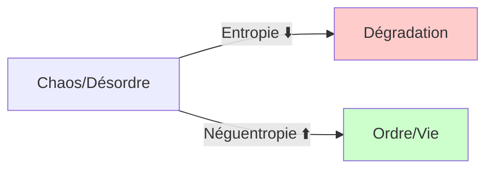
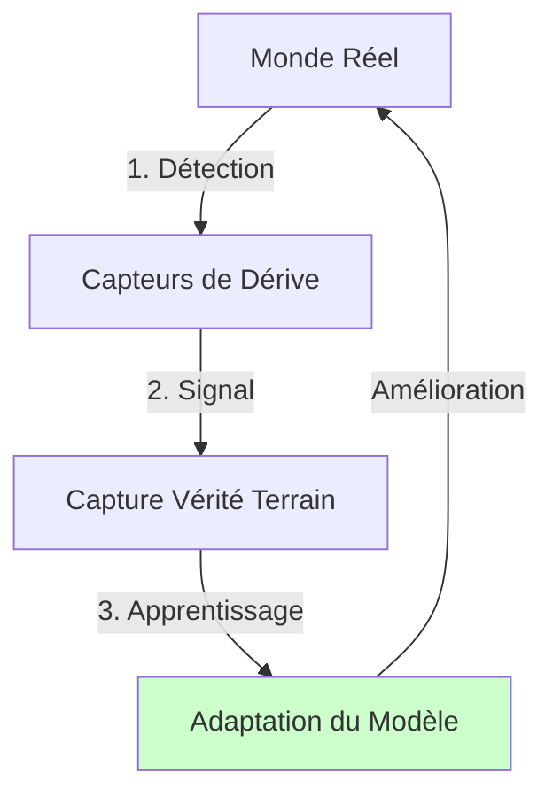
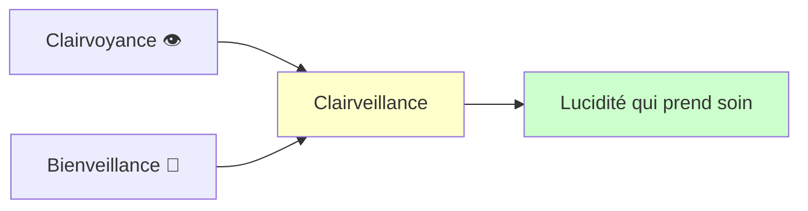

# Entropie, Néguentropie et Clairveillance : Comment nos machines nous apprennent à bâtir un monde plus lucide

## Introduction : Les Deux Forces de l'Univers ⚖️

Au cœur de notre univers s'affrontent deux forces fondamentales. La première, implacable et universelle, est l'**entropie**. C'est la tendance naturelle de tout système à glisser vers le désordre, la dégradation et le chaos. C'est une loi physique qui régit aussi bien la dispersion de l'énergie que la complexification d'un code informatique ou la désorganisation de nos sociétés lorsqu'elles se mentent à elles-mêmes.

Face à elle se dresse une force plus discrète, presque miraculeuse : la **néguentropie**. C'est le secret de la vie elle-même. C'est la capacité à créer de l'ordre, du sens et de l'organisation à partir du chaos. Un arbre qui pousse est un miracle de néguentropie, une structure complexe et vivante qui s'érige au milieu de l'aléatoire. La vie est ce mouvement qui transforme le désordre en équilibre et le hasard en information.

> **Thèse centrale :** Les plans d'architecture que nous concevons pour rendre nos machines plus robustes face au chaos sont, en réalité, des schémas directeurs pour des sociétés plus lucides et résilientes.

Pour explorer cette idée vertigineuse, nous commencerons par un exemple surprenant : les systèmes d'intelligence artificielle.

---

## 1. L'Analogie Centrale : La Machine Face au Chaos du Réel

L'intelligence artificielle nous offre une métaphore saisissante pour comprendre la lutte entre ordre et désordre. La manière dont nous concevons ces systèmes révèle profondément notre rapport au changement et à l'incertitude.

### 1.1. La Machine Entropique : La "Voiture de Course Artisanale" 🏎️

La plupart des projets de Machine Learning traditionnels s'apparentent à la construction d'une **voiture de course artisanale**. C'est une merveille de technologie, ultra-performante et impressionnante dans un environnement parfaitement contrôlé : sur un circuit connu, par temps sec.

Cependant, ce système est fondamentalement **entropique**. Dès que le monde réel, imprévisible et changeant, s'en mêle (si la météo change ou si la route se dégrade), cette machine sophistiquée devient inutile, voire dangereuse. Elle se dégrade passivement et en silence. Son véritable ennemi n'est pas un bug dans le code, mais le **chaos du réel** et la **"dérive" (drift)** des données, ce décalage insidieux entre le monde sur lequel elle a été entraînée et le monde tel qu'il est devenu.

### 1.2. La Machine Néguentropique : "L'Usine Intelligente" 🏭

En contraste, une approche architecturale radicalement différente propose de bâtir non plus une voiture de course, mais une **usine automobile complète et certifiée**. Le changement de paradigme est total : ce système n'est pas conçu pour se protéger du changement, mais pour **s'en nourrir**. L'incertitude n'est plus un risque à éviter, mais le moteur même de son amélioration.

**Le mécanisme clé** est celui d'un cycle d'apprentissage dynamique :

1. **Capteurs** pour détecter la dérive → le système sent que le monde a changé
2. **Capture de la "vérité terrain"** → ce feedback précieux du réel devient le carburant de l'évolution
3. **Apprentissage automatique** → cette information déclenche une adaptation et un renforcement

La crise qui était une menace devient un signal, un cycle d'apprentissage qui renforce le modèle. Ce n'est plus une "statue de marbre", figée et fragile, mais un **organisme vivant**, capable d'apprendre et d'évoluer en permanence.

> _Comment, concrètement, une machine peut-elle apprendre à créer de l'ordre à partir du désordre ?_

La réponse ne se trouve pas seulement dans la technique, mais dans une série de principes d'organisation que l'on pourrait qualifier de "pactes sociaux".

---

## 2. Les Principes de l'Ordre : Les Contrats Socio-Techniques 🤝

Pour vaincre l'entropie, l'architecture du système doit forcer des conversations et des accords humains. Chaque brique technique devient aussi une brique sociale, un point de rencontre obligatoire où des pactes sont scellés. Ces accords sont formalisés par des **"contrats"**.

### 2.1. Le Contrat Sémantique : Se Mettre d'Accord sur le Sens des Mots

Ce premier pacte s'attaque à la source la plus commune de désordre : **le chaos de l'interprétation**. Il force tous les acteurs (experts métier, data scientists, ingénieurs) à utiliser la même définition rigoureuse pour les mêmes concepts.

- **Exemple :** Un terme comme "activité client sur 30 jours" ne peut plus être ambigu.
- **Outil technique :** Le **Feature Store** agit comme le gardien d'un "langage ubicuitaire" partagé.
- **Principe fondateur :** En faisant de la clarté sémantique la base non-négociable de la collaboration, il pose le principe fondateur de toute société fonctionnelle : **un accord sur le langage**.

### 2.2. Le Contrat de Valeur : Se Mettre d'Accord sur la Finalité

Ce contrat est un pacte sur le **"pourquoi"**, liant chaque effort technique à sa raison d'être. Un nouveau modèle d'Intelligence Artificielle, même techniquement plus précis, qui bafoue ces accords tacites, génère plus d'entropie qu'il n'en résout.

- **Outil technique :** Le **Model Registry** est le gardien de ce pacte, en forçant à lier chaque modèle à un impact mesurable.
- **Remède à l'entropie :** On ne déploie plus un système parce qu'il est "techniquement meilleur", mais parce qu'il **"crée plus de valeur"**.
- **Principe :** Un mécanisme qui impose une **honnêteté radicale** contre "l'innovation pour l'innovation".

### 2.3. Le Contrat de Validité : Se Mettre d'Accord pour Douter

Ce dernier contrat, peut-être le plus humble, **institutionnalise le doute** en posant en permanence la question : _"Est-ce que notre vision du monde est toujours correcte ?"_

- **Mécanisme technique :** La **surveillance de la dérive des données** (drift monitoring) est un mécanisme anti-dogmatique intégré au cœur de la machine.

À l'inverse, que se passerait-il si nous appliquions les trois contrats socio-techniques à l'échelle de nos sociétés ?

| Contrat         | Application Technologique                                          | Application Sociétale                                                                                              |
| --------------- | ------------------------------------------------------------------ | ------------------------------------------------------------------------------------------------------------------ |
| **Sémantique**  | Un langage partagé sur les données, incarné par le Feature Store.  | Définir rigoureusement des termes comme "croissance durable" ou "justice sociale" pour permettre un débat honnête. |
| **De Valeur**   | Lier un modèle à un impact métier mesurable via le Model Registry. | Exiger que chaque politique publique prouve sa valeur réelle et mesurable pour la collectivité.                    |
| **De Validité** | Questionner en continu la pertinence via le Monitoring de Drift.   | Mettre en place des mécanismes citoyens pour constamment questionner nos certitudes et nos dogmes collectifs.      |

Cela dessine le contour d'un modèle de société basé sur l'apprentissage, l'empathie et la lucidité, une société qui ne prétend pas être parfaite mais dont l'essence même est de s'améliorer en écoutant le réel.

Construire de tels systèmes ne relève pas seulement de la technologie, mais aussi d'une posture intérieure, d'une éthique du regard. C'est ce que le manifeste de la Clairveillance propose.

---

## Conclusion : La Clairveillance, une Néguentropie à Visage Humain 💡

La Clairveillance, néologisme issu de "clairvoyance + bienveillance", est une proposition éthique pour incarner ces principes néguentropiques à l'échelle humaine. C'est une lucidité qui prend soin. Elle est la manifestation humaine des contrats que nous venons d'explorer : "voir clair" correspond à la capture de la vérité terrain, et "prendre soin" correspond à la création d'ordre sans détruire.

Les principes de la Clairveillance sont l'écho philosophique de ces mécanismes. Le "Contrat Sémantique" est l'incarnation du principe "Partager la vérité". Le "Contrat de Valeur" force à "Répondre de son regard" sur l'impact de nos créations. Le "Contrat de Validité" est une invitation systémique à "Voir clair" en permanence, en refusant le dogme. Ils nous invitent à construire des systèmes (personnels, sociaux, collectifs) qui ne cherchent pas à imposer une vérité figée, mais qui apprennent à allumer la lumière ensemble.

Nous appelons à une mutation douce mais radicale : celle d'une humanité capable de conscience partagée. Que la clarté ne serve plus à dominer, mais à relier.

---

## 📖 Pour Aller Plus Loin

Pour une exploration approfondie de ces concepts appliqués à la politique, consultez :

**[Le Manifeste de la Clairveillance : Pour une Politique Néguentropique](./docs/CLAIRVEILLANCE.md)**

Ce document développe comment les principes néguentropiques peuvent être transposés à l'échelle sociétale, en détaillant les trois Contrats et une dynamique d'apprentissage continu pour nos institutions.

---

**Licence** : Ce contenu est distribué sous [licence Creative Commons BY-SA 4.0](LICENSE)
