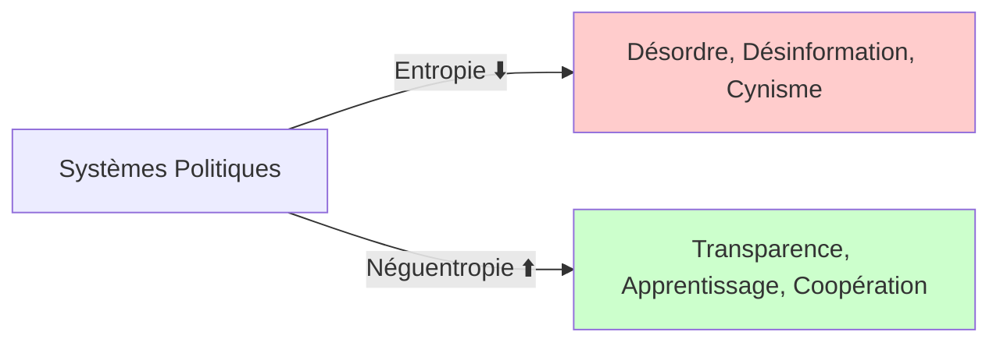
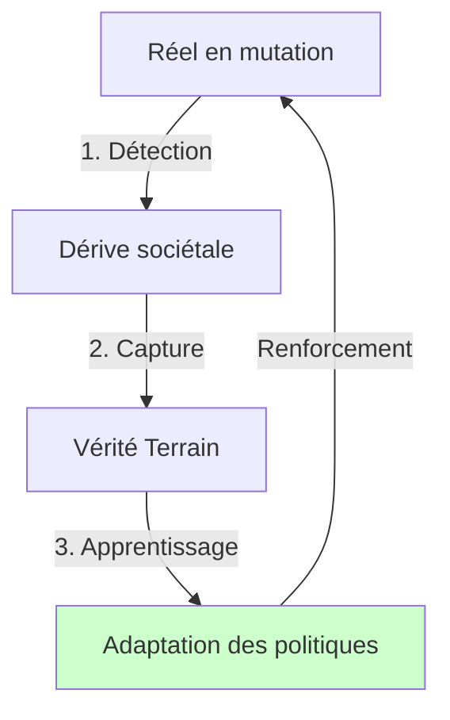

# Manifeste de la Clairveillance

## Pour une Politique Néguentropique

### Préambule

> _Pour une lucidité qui prend soin._

L'univers tend vers le désordre. Cette loi physique, appelée **entropie**, décrit la dégradation progressive de toute forme d'énergie et d'information.

Mais la vie, elle, fait exception : elle transforme le chaos en équilibre, l'aléatoire en sens. C'est ce mouvement inverse qu'on appelle **néguentropie** : la création d'ordre vivant, d'harmonie dynamique, d'organisation qui apprend.

Nos sociétés obéissent à la même loi : elles s'entropisent lorsqu'elles se ferment, se durcissent, se mentent à elles-mêmes. Elles deviennent néguentropiques lorsqu'elles apprennent, coopèrent, s'éclairent mutuellement.

**La Clairveillance est ce mouvement de vie à l'échelle humaine** : la lucidité qui éclaire sans brûler, la conscience qui ordonne sans dominer, la clarté qui relie plutôt qu'elle ne sépare.

---

## I. Du Diagnostic

### L'Entropie comme Mal Social et la Néguentropie comme Horizon

Pour concevoir une solution systémique, il faut d'abord poser un diagnostic lucide. Le mal qui ronge nos organisations collectives est l'entropie sociale, et son antidote est la néguentropie.

Prenons l'exemple d'une bibliothèque. Sans soin constant, les livres se dispersent, les classements deviennent incohérents, l'information devient inaccessible : c'est l'entropie à l'œuvre. Mais si les bibliothécaires écoutent les usagers, réorganisent les collections selon les besoins réels, et créent des systèmes d'indexation vivants, la bibliothèque devient un organisme apprenant. Elle ne se contente pas de résister au désordre : elle se renforce en l'anticipant.

Nos institutions politiques ressemblent trop souvent à des bibliothèques abandonnées : des structures figées qui ne répondent plus aux questions que pose le réel. L'ambition néguentropique est de les transformer en organismes vivants, capables d'apprendre de leurs erreurs et de s'adapter aux mutations du monde.

## II. Des Fondements

### Les Sept Principes Éthiques de la Clairveillance

Toute structure politique durable doit reposer sur un "Pourquoi" puissant. La Clairveillance répond à ce besoin en définissant une téléologie précise : l'avènement d'une gouvernance "ouverte, polycentrique, apprenante".

Le concept de Clairveillance (Clairvoyance + Bienveillance) se définit comme une "mutation douce mais radicale vers une humanité capable de conscience partagée". Dans ce cadre, la valeur suprême n'est plus le "pouvoir figé", mais la capacité collective à créer une "harmonie dynamique".

Cette vision s'ancre dans l'action à travers sept principes fondateurs :

**Article 1 : Voir clair**

La clairveillance commence par un regard lucide sur le réel tel qu'il est : sans le fuir, sans le tordre, sans le haïr. La lucidité n'est pas le désenchantement : c'est la condition d'une action juste, profondément ancrée dans les faits.

**Article 2 : Prendre soin**

La clairveillance reconnaît que la douceur est une force politique. Agir avec bienveillance, ce n'est pas être faible, c'est choisir d'agir sans détruire. L'écoute, la compréhension, la patience sont des formes d'intelligence sociale qui maintiennent la cohésion du vivant. La lucidité sans bienveillance peut devenir un instrument de domination.

_Tension assumée_ : Parfois, voir clair révèle des vérités qui blessent. La clairveillance n'élude pas cette difficulté : elle exige de dire la vérité avec soin, de critiquer sans humilier, de désaccorder sans détruire. C'est un équilibre fragile, un art politique à cultiver.

**Article 3 : Répondre de son regard**

Être clairveillant, c'est assumer la responsabilité du regard qu'on porte. Chaque opinion, chaque décision, chaque mot façonne la texture du monde. La vigilance intérieure devient un devoir civique : voir juste, pour agir juste.

_Exemple_ : Un élu qui dénonce une politique sans avoir étudié ses effets réels, ou un citoyen qui partage une information sans l'avoir vérifiée, abdiquent leur responsabilité de regard. La clairveillance exige qu'on ne parle qu'à partir de ce qu'on a pris le temps de comprendre.

**Article 4 : Partager la vérité**

La clairveillance refuse les monopoles du savoir. La vérité n'est pas un trône mais un chemin collectif. Elle se construit dans la confrontation respectueuse, la transparence, et devient un processus d'apprentissage partagé plutôt qu'un objet de propagande.

**Article 5 : Gouverner autrement**

La clairveillance inspire une gouvernance néguentropique : ouverte, polycentrique, apprenante. Elle valorise la diversité cognitive et la responsabilité distribuée. Les institutions clairveillantes ne prétendent pas posséder la lumière : elles apprennent à orienter le regard collectif.

**Article 6 : Cultiver une écologie du regard**

La clairveillance s'étend à toutes les sphères : écologique, technologique, culturelle, économique. Elle invite à une écologie de la perception : ralentir, observer, comprendre avant d'agir. Le monde n'est pas une ressource : c'est une relation.

**Article 7 : Transmettre la clarté**

Une société clairveillante n'impose pas la lumière : elle apprend à l'allumer ensemble, par le dialogue, l'exemple et la patience.

---

Ces sept principes forment le socle éthique de la Clairveillance. Mais une vision, aussi puissante soit-elle, reste lettre morte sans structure pour l'incarner dans le réel. C'est le rôle de l'ossature des trois Contrats.

## III. De l'Ossature

### Les Trois Contrats d'un Nouveau Pacte Social

Pour être efficace, une philosophie politique doit s'incarner dans un tissu vivant où les structures combattent les dérives. La Clairveillance matérialise sa vision à travers trois Contrats néguentropiques qui forcent le dialogue, la rigueur et la responsabilité.

| Contrat            | Entropie Combattue | Principe Éthique | Mécanisme                        |
| ------------------ | ------------------ | ---------------- | -------------------------------- |
| **Sémantique** 📝  | Ambiguïté          | Voir clair       | Langage partagé rigoureux        |
| **De Valeur** 🎯   | Agitation stérile  | Prendre soin     | Impact mesurable sur la cohésion |
| **De Validité** 🔍 | Dogmatisme         | Voir clair       | Monitoring de dérive permanent   |

#### A. Le Contrat Sémantique

_Contre l'Entropie de l'Ambiguïté_

Ce contrat s'attaque à l'ambiguïté, puissant outil de manipulation permettant de diluer les responsabilités. Il impose la création d'un "langage partagé et rigoureux pour débattre des vrais problèmes". En lien avec le principe de "Voir clair", il force les acteurs à s'accorder sur la définition de concepts cruciaux comme la "croissance durable" ou la "justice sociale". Il transforme la vérité d'un objet de propagande en un "chemin collectif construit dans la transparence".

**Exemple concret** : Avant toute délibération sur une politique climatique, les parties prenantes doivent d'abord s'accorder sur un glossaire commun définissant précisément ce qu'on entend par "neutralité carbone", "transition juste", ou "décroissance". Ce langage partagé devient la base contractuelle du débat.

#### B. Le Contrat de Valeur

_Contre l'Entropie de l'Agitation Stérile_

Ce contrat combat la multiplication d'initiatives sans impact réel. En exigeant une "honnêteté radicale", il impose qu'une politique soit rejetée si elle n'améliore pas le bien commun. Chaque politique doit justifier son "impact mesurable sur la cohésion ou la bienveillance". Ce mécanisme déplace la gouvernance du terrain de l'idéologie vers celui des faits.

**Exemple concret** : Une réforme éducative ne peut être adoptée que si elle démontre, par des indicateurs vérifiables (taux de décrochage, bien-être des élèves, équité d'accès), qu'elle améliore concrètement le système. Les effets d'annonce et les promesses idéologiques ne suffisent plus.

#### C. Le Contrat de Validité

_Contre l'Entropie du Dogmatisme_

Ce contrat institutionnalise le doute via un "Monitoring de Dérive" sociétal permanent. Ce n'est pas un simple appel au dialogue, mais un système immunitaire qui détecte en continu lorsque le modèle gouvernemental ne correspond plus à la réalité du terrain. La définition des seuils d'alerte devient une "discussion stratégique" impliquant les citoyens.

**Exemple concret** : Si le coefficient de Gini (mesure des inégalités) dépasse un seuil défini collectivement, une révision obligatoire des politiques fiscales est déclenchée. Ce n'est pas une réaction partisane, mais un mécanisme automatique de remise en question.

**Garde-fou essentiel** : Pour éviter que ce monitoring devienne lui-même un outil de surveillance autoritaire, il doit être transparent, décentralisé, et soumis à un contrôle citoyen permanent. Les seuils d'alerte sont débattus publiquement et révisables.

## IV. De la Dynamique

### Apprendre du Chaos pour se Renforcer

La force d'un système néguentropique ne réside pas dans sa capacité à éviter les crises, mais dans sa faculté à s'en nourrir. Le "chaos du réel" est ainsi considéré comme un déclencheur d'apprentissage. Une crise sociale ou écologique est un signal que le modèle sociétal en place est devenu obsolète, un appel à évoluer.

#### La Mémoire Événementielle : Tracer la Causalité

Le défi majeur est de surmonter la "Vérité Terrain Retardée", où les conséquences d'une décision n'apparaissent que des années plus tard. Pour y répondre, la Clairveillance exige une "mémoire événementielle" : un système qui enregistre les décisions politiques et leurs conséquences à long terme.

**Concrètement** : Chaque loi, chaque politique publique est accompagnée d'un "contrat d'impact" qui spécifie les résultats attendus et les indicateurs de suivi. Ces données sont archivées dans un registre public accessible à tous. Dix ans plus tard, lorsque les effets se manifestent, on peut infailliblement retracer la chaîne causale : quelle décision a produit quel effet ? Qui l'a portée ? Sur quelles hypothèses ?

Ce n'est pas un outil de punition, mais d'**apprentissage collectif**. L'objectif n'est pas de chercher des coupables, mais de comprendre pourquoi certaines politiques échouent pour ne pas reproduire les mêmes erreurs.

#### La Boucle de Rétroaction : De la Crise à l'Évolution

Lorsqu'une dérive est détectée (par le Contrat de Validité), un cycle de ré-évaluation s'enclenche automatiquement :

1. **Alerte** : Les citoyens et experts sont informés de la dérive
2. **Diagnostic partagé** : Des assemblées délibératives analysent les causes (Contrat Sémantique)
3. **Propositions alternatives** : De nouvelles politiques sont débattues et évaluées (Contrat de Valeur)
4. **Expérimentation** : Les solutions sont testées à échelle réduite avant généralisation
5. **Intégration** : Les apprentissages enrichissent la mémoire collective

Une crise n'est plus une catastrophe, mais une opportunité d'apprentissage qui renforce le système.

## V. De la Transition

### Comment Passer d'un Système Entropique à un Système Néguentropique ?

La Clairveillance ne prétend pas renverser les institutions existantes du jour au lendemain. Elle propose plutôt une **stratégie de transformation progressive** :

#### Premiers Pas Concrets

**À l'échelle individuelle** : Chacun peut devenir un agent de clairveillance en pratiquant la lucidité bienveillante dans ses interactions quotidiennes. Questionner ses certitudes, écouter vraiment, exiger la clarté sémantique dans les débats.

**À l'échelle des organisations** : Les entreprises, associations, collectivités peuvent expérimenter les trois Contrats à leur échelle. Créer des glossaires partagés, mesurer l'impact réel de leurs actions, instaurer des mécanismes de remise en question collective.

**À l'échelle politique** : Les élus et décideurs peuvent introduire ces principes dans leurs pratiques : budgets participatifs avec Contrat de Valeur, assemblées citoyennes utilisant le Contrat Sémantique, observatoires indépendants appliquant le Contrat de Validité.

**Exemples vérifiables** : Ces principes ne sont pas théoriques. Ils fonctionnent déjà dans plusieurs contextes :

🇹🇼 **vTaiwan (Taïwan, depuis 2014)** : Plateforme délibérative nationale combinant outil de consensus numérique et rencontres physiques. Sur 28 cas traités, 80% ont abouti à une adoption gouvernementale. Le processus force la clarification des positions avant débat (Contrat Sémantique) et mesure systématiquement l'impact des décisions adoptées (Contrat de Valeur). Résultat : consensus législatifs sur des sujets complexes comme la régulation d'Uber ou l'encadrement des FinTech.

🇧🇪 **Conseil Citoyen Permanent d'Ostbelgien (Belgique, depuis 2019)** : Premier parlement citoyen permanent au monde, institutionnalisé dans la constitution régionale. 24 citoyens tirés au sort pour 18 mois travaillent avec des protocoles stricts de clarification sémantique (Contrat Sémantique), démontrent l'impact social de chaque recommandation (Contrat de Valeur), et sont renouvelés par tiers tous les 6 mois pour maintenir l'adaptation continue (Contrat de Validité). Sur la première assemblée, 15 des 18 recommandations ont été adoptées par le Parlement.

🇬🇧 **Assemblée Citoyenne Climat UK (2020)** : 108 citoyens représentatifs ont produit 554 recommandations détaillées après une phase d'apprentissage structurée créant un vocabulaire partagé (Contrat Sémantique). Le Comité parlementaire sur le Changement Climatique assure un suivi semestriel public mesurant l'écart entre recommandations et politiques réelles (Contrat de Validité). Résultat : 81% des recommandations ont reçu un soutien de 60% ou plus des membres.

**Preuve technique** : Dans le domaine de l'intelligence artificielle, des organisations appliquent des mécanismes similaires : vocabulaire technique partagé par toutes les équipes, mesure obligatoire de l'impact réel avant tout déploiement, surveillance continue déclenchant des alertes automatiques. Les résultats montrent que les erreurs sont détectées beaucoup plus rapidement, et que ce que le système fait correspond bien mieux à ce qui est réellement utile. Si ces principes permettent à des machines d'apprendre de leurs erreurs et de s'améliorer continuellement, pourquoi nos institutions ne le pourraient-elles pas ?

#### Les Acteurs du Changement

La transition vers la Clairveillance ne peut être imposée d'en haut. Elle nécessite une coalition large :

- **Citoyens éclairés** exigeant la transparence et la cohérence
- **Chercheurs et intellectuels** formalisant les méthodes et mesurant les impacts
- **Décideurs visionnaires** acceptant de soumettre leur action au doute collectif
- **Organisations de la société civile** expérimentant ces principes sur le terrain

#### Reconnaître les Obstacles

Soyons lucides : cette transformation rencontrera des résistances. Les bénéficiaires du statu quo, les dogmatiques de tous bords, ceux qui prospèrent dans l'ambiguïté s'opposeront à cette clarification. La Clairveillance exige aussi un effort : penser avec rigueur, remettre en question ses certitudes, accepter la complexité. Ce n'est pas un chemin facile, mais c'est un chemin nécessaire.

#### Objections & Réponses

**Objection 1 : "C'est une technocratie déguisée"**  
_Réponse_ : Au contraire. La Clairveillance démocratise l'expertise en rendant les critères de décision transparents et débattables. Les seuils d'alerte, les indicateurs, les glossaires sont définis collectivement, pas par une élite technique. C'est une démocratie outillée, pas une technocratie.

**Objection 2 : "Les seuils d'alerte seront manipulés par ceux au pouvoir"**  
_Réponse_ : C'est pourquoi le Contrat de Validité exige transparence, décentralisation et contrôle citoyen. Les seuils sont publics, leur calcul vérifiable, leur révision participative. La manipulation devient visible et contestable.

**Objection 3 : "Trop complexe pour être mis en œuvre"**  
_Réponse_ : Pas plus complexe que nos systèmes actuels, juste plus honnête. Les trois Contrats peuvent commencer à petite échelle, dans une ville, une région, une organisation. La complexité se construit progressivement, par apprentissage.

**Objection 4 : "La mémoire événementielle inhibera l'audace politique"**  
_Réponse_ : L'objectif n'est pas de punir l'échec, mais d'apprendre de lui. Un décideur qui expérimente, échoue, et documente honnêtement son échec contribue plus à la société qu'un décideur qui ne prend aucun risque. La mémoire valorise l'honnêteté, pas la perfection.

---

## Conclusion

### Vers un Organisme Politique Vivant

En définitive, la Clairveillance propose une mutation fondamentale : passer d'un modèle politique mécanique, semblable à une "horloge" dont les rouages s'usent inexorablement, à un modèle organique et adaptatif, un "organisme vivant" capable d'apprendre et d'évoluer.

L'analogie la plus juste est celle d'un écosystème forestier. Tandis qu'un système traditionnel est une construction rigide, un État clairveillant est une forêt. Ses institutions sont des arbres, sensibles à leur environnement, et reliés par un vaste réseau mycélien souterrain (les trois Contrats et la boucle de feedback) qui véhicule l'information et permet une adaptation collective. Une crise n'est plus une menace fatale, mais un signal qui renforce la résilience de l'ensemble.

### Appel Final

**Nous appelons à une mutation douce mais radicale : celle d'une humanité capable de conscience partagée. Ni soumise, ni arrogante, simplement lucide et bienveillante.**

Ce manifeste s'adresse à tous ceux qui refusent à la fois le cynisme résigné et l'utopisme naïf. À ceux qui croient qu'une autre politique est possible, non pas en niant la complexité du réel, mais en l'embrassant avec lucidité et soin.

#### Que Faire Dès Maintenant ?

**Si vous êtes citoyen** : Exigez la clarté sémantique dans les débats publics. Questionnez les effets d'annonce. Soutenez les initiatives qui pratiquent la transparence et l'évaluation honnête.

**Si vous êtes décideur** : Expérimentez les trois Contrats dans votre périmètre d'action. Acceptez la vulnérabilité du doute. Mesurez vos impacts réels, pas vos intentions.

**Si vous êtes chercheur** : Documentez ces expérimentations. Créez les outils de mesure de la néguentropie sociale. Formalisez les méthodes qui fonctionnent.

**Si vous êtes éducateur** : Transmettez ces principes aux générations futures. Apprenez-leur à voir clair avec bienveillance, à questionner sans détruire, à construire dans la transparence.

_Que la clarté ne serve plus à dominer, mais à relier._
_Que le doute ne soit plus une faiblesse, mais une force._
_Que la bienveillance ne soit plus une naïveté, mais une politique._

---

## Annexe

### Lexique des Concepts Fondamentaux

**Entropie**  
Tendance naturelle d'un système à se désorganiser, à perdre de l'énergie ou du sens. Dans le champ social : accumulation de désordre, de désinformation, de cynisme.

**Néguentropie**  
Force inverse : capacité à créer de l'ordre vivant, de la cohérence, de la connaissance. Dans la société : transparence, apprentissage, coopération.

**Clairveillance**  
_(néologisme issu de clairvoyance + bienveillance)_ Capacité à voir avec lucidité tout en préservant la bienveillance. C'est une éthique du regard et un principe politique : comprendre sans condamner, agir sans blesser, apprendre sans dominer.

**Contrat Sémantique**  
Mécanisme qui impose un langage partagé et rigoureux pour combattre l'ambiguïté dans le débat public et politique.

**Contrat de Valeur**  
Mécanisme qui exige que chaque politique justifie son impact mesurable sur la cohésion et la bienveillance, combattant l'agitation stérile.

**Contrat de Validité**  
Mécanisme antidogmatique qui institutionnalise le doute par un monitoring permanent de la dérive entre modèle sociétal et réalité terrain.

**Mémoire Événementielle Politique**  
Dispositif conçu pour enregistrer les décisions et leurs conséquences à long terme, permettant de tracer chaque impact à sa cause initiale.

**Vérité Terrain Retardée**  
Phénomène où les conséquences d'une décision politique n'apparaissent que des années après sa mise en œuvre, rendant difficile l'apprentissage des erreurs.

**Boucle de Rétroaction**  
Processus cyclique par lequel les signaux du réel (crises, dérives) déclenchent une révision des politiques, qui elles-mêmes influencent le réel, créant un système d'apprentissage continu.

**Gouvernance Néguentropique**  
Mode de gouvernance ouverte, polycentrique et apprenante, qui valorise la diversité cognitive et la responsabilité distribuée.

---

**Licence** : Ce document est distribué sous [licence Creative Commons BY-SA 4.0](../LICENSE)
